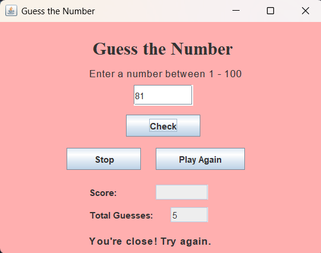

# Number Guessing Game – Java

A simple interactive Number Guessing Game developed using Java Swing.

## Project Overview

The application generates a random number between 1 and 100. 
The player has a maximum of 10 attempts to guess the correct number.

## Features

- Random number generation
- Java Swing GUI
- Input validation
- Too High / Too Low hints
- Close-number hint
- Attempt tracking
- Score calculation
- Play Again functionality
- Stop button
- Exception handling

## Technologies Used

- Java
- Java Swing
- AWT
- Event Handling
- Object-Oriented Programming

## How to Run

Compile the program:

```bash
javac NumberGuessingGame.java

## Screenshot


